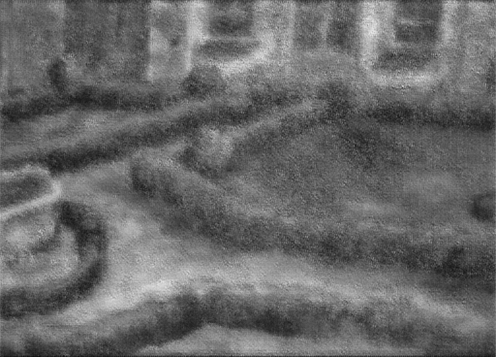

# Deep Layers

[](https://www.apache.org/licenses/)
[](https://www.python.org/downloads/)
[](https://www.tensorflow.org/)
[](https://opencv.org/)

## Project Description
This project trains a conditional GAN to generate infrared (IR) images from RGB inputs, with a specific focus on **revealing underpainting traces** in artworks. By learning how “normal” IR looks for surfaces *without* underdrawings, the model helps highlight where reality deviates from this expectation, i.e. where hidden drawings are likely present.

## Group Members
- [Simone Caglio](https://github.com/SimoneFisico)
- [Marco Manduca](https://github.com/MarcoManduca)

## Tech Spec
-  **Language:** Python 3.10-3.11
-  **Frameworks and Libraries:** This project uses standard libraries for deep learning and computer vision such as `numpy`, `tensorflow`, `opencv-python`, and `matplotlib`. See [`requirements.txt`](./requirements.txt) for the full list of dependencies.
- This project was developed and tested on macOS with an Apple Silicon chip. To leverage Metal acceleration on Mac GPUs, follow the TensorFlow Metal plugin instructions: [`tensorflow-plugin`](https://developer.apple.com/metal/tensorflow-plugin/). When a compatible GPU is available, TensorFlow will automatically run the model on GPU; the training and testing scripts also configure GPU memory growth to avoid allocation issues.

## Installation
### Prerequisites
-  **Python:** Make sure you have Python 3.10 or 3.11 installed.
-  **Package Manager:** You will need `pip` or `conda` to install the dependencies.
### Installation Steps
1.  **Clone the repository:**

```bash
git clone git@github.com:MarcoManduca/deep_layers.git
cd  deep_layers
```
2.  **Create a virtual environment (optional but recommended):**
- Using venv:
```bash
python3  -m  venv  venv
source  venv/bin/activate  # On Windows: venv\Scripts\activate
```
- Using conda:
```bash
conda  create  --name  deep_layers  python=3.11
conda  activate  deep_layers
```
3.  **Install the dependencies:**
- With pip:
```bash
pip  install  -r  requirements.txt
```

> **Note for Conda users:** even if you use a Conda environment, install this project's dependencies with `pip install -r requirements.txt`.
> Some packages in `requirements.txt` (for example `opencv-python`) are pip package names and are not available through `conda install --file requirements.txt`.

#### Conda alternatives (optional)

If you prefer Conda packages where possible, install from `conda-forge` first and then use `pip` only for anything missing:

```bash
conda install -c conda-forge numpy tensorflow opencv matplotlib python-dotenv scikit-image tqdm
```

Then, if needed, complete the environment with:

```bash
pip install -r requirements.txt
```

## Configuration

Training is configured via environment variables loaded from a local [`.env`](./.env) file (not committed to the repository). You can use [`.env.example`](./.env.example) as a starting point:

- **BATCH_SIZE**: training batch size (e.g. `1` or `4`)
- **EPOCHS**: number of training epochs (e.g. `5`)
- **IMG_SIZE**: square image size used by the models (e.g. `512`)
- **KERNEL_SIZE**: convolution kernel size (e.g. `5`)
- **STRIDES**: stride used in convolutions / transposed convolutions (e.g. `2`)
- **TRAIN_RGB_PATH**: directory containing RGB training images (e.g. `./data/training/rgb`)
- **TRAIN_IR_PATH**: directory containing IR training images (e.g. `./data/training/ir`)
- **MODELS_DIR**: where to save trained models (default: `./models`)
- **CHECKPOINT_DIR**: where to save training checkpoints (default: `./checkpoints`)
- **SEED**: optional integer seed for reproducible training (if omitted, no seeding is applied)

Copy the example file and adjust values as needed:

```bash
cp .env.example .env
```

## Usage

### 1. Prepare data

- Place RGB training images in `data/training/rgb`
- Place corresponding IR images in `data/training/ir`

Ensure that each RGB image has a matching IR image with the same filename.

Conceptually, the **training pairs should come from areas (or artworks) where no underpainting/underdrawings are expected**. The model learns a mapping `RGB → IR` that captures material and surface behavior without hidden drawings.

### 2. Train the GAN

From the repository root, run:

```bash
python -m scripts.train
```

This will:

- load configuration from `.env`
- build the generator and discriminator models
- train the GAN on the paired RGB/IR dataset
- save the trained models in the `models/` directory (`generator.keras` and `discriminator.keras`)

### 3. Test a trained model

Given a trained generator saved in the `models/` directory, you can generate an IR-like image from a single RGB input:

```bash
python -m scripts.test --input path/to/input_rgb.jpg --output outputs/generated_ir.png
```

This will load `generator.keras` from `models/` directory, run inference, and save a normalized IR-like image.

#### Example RGB → IR → Generated triplet

Below is an example triplet that shows the full pipeline:

<table>
  <tr>
    <th>RGB input</th>
    <th>Real IR</th>
    <th>Generated IR</th>
  </tr>
  <tr>
    <td></td>
    <td></td>
    <td></td>
  </tr>
</table>

In a typical analysis scenario:

1. The model is trained on **RGB–IR pairs without underpaintings** (as described above).
2. A new RGB image is acquired from an artwork where underpaintings are suspected.
3. The generator predicts the corresponding IR image from this RGB input.
4. By **comparing the predicted IR with the real IR** (for example using `scripts.evaluate.py` or custom difference maps), the deviations between the two images should emphasize the **underpainting traces**, since the model expects a “clean” IR signal and any additional structure stands out as an anomaly.

### 4. Evaluate model performance

Given a set of real IR images and corresponding generated IR images (same filenames), you can compute a bucket of metrics (MAE, MSE, PSNR, SSIM):

```bash
python -m scripts.evaluate --real-dir data/test/ir --gen-dir data/test/generated --ext .jpg
```

This prints per-image metrics and their averages across the dataset.

**Metric definitions (per image):**

- **MAE (Mean Absolute Error)**: average absolute difference between pixel intensities in real vs generated IR images.
- **MSE (Mean Squared Error)**: average squared difference between pixel intensities (penalizes larger errors more strongly than MAE).
- **PSNR (Peak Signal-to-Noise Ratio)**: logarithmic measure (in dB) of reconstruction quality; higher PSNR usually indicates closer similarity. See, for example, the PSNR definition in the `skimage.metrics.peak_signal_noise_ratio` documentation.
- **SSIM (Structural Similarity Index)**: perceptual metric that considers luminance, contrast, and structure; values close to 1 indicate high structural similarity. See, for example, `skimage.metrics.structural_similarity` and the original SSIM paper by Wang et al., *“Image Quality Assessment: From Error Visibility to Structural Similarity”*, IEEE TIP 2004, available at [IEEE Xplore](https://ieeexplore.ieee.org/document/1284395).

### 5. Underpainting difference maps

In addition to global metrics, you can visualize **where** the model disagrees with the real IR by computing a pixel-wise difference map between real and generated IR images:

```bash
python -m scripts.diff_map --real data/test/ir/05.jpg --pred data/test/generated/05.jpg
```

This produces a normalized grayscale image (saved next to the predicted IR as `*_diff`), where brighter regions correspond to larger discrepancies between the real and predicted IR signal. When the model has been trained on areas without underpaintings, these discrepancies tend to align with **underpainting traces**, since the model cannot explain them as part of the “normal” IR appearance.

### 6. Project structure

The core code is organized as a Python package:

- `deep_layers/config.py`: configuration and environment handling
- `deep_layers/data.py`: data loading, preprocessing, and dataset utilities
- `deep_layers/models.py`: GAN architectures and training loop
- `scripts/train.py`: CLI entry point for training
- `scripts/test.py`: CLI entry point for testing / inference
- `scripts/evaluate.py`: CLI entry point for evaluating generated IR vs real IR images
- `scripts/diff_map.py`: CLI entry point for computing underpainting difference maps (real IR vs generated IR)

## License
This project is licensed under the Apache License. See the [LICENSE](./LICENSE) file for more details.
