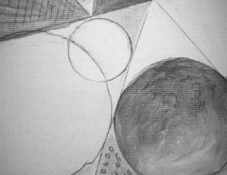
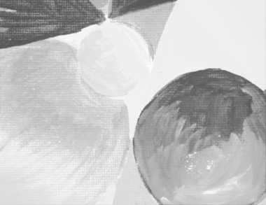
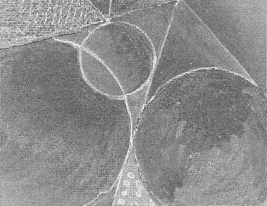

# Deep Layers

Deep-learning pipeline for detection of anomalies in real IR images. A network learns to predict the IR appearance of a painting starting from RGB visible image and wherever the real IR image departs from that prediction, the differences point to something the visible surface does not explain.

The project implements and benchmarks two families of model:

- **deterministic** — one predicted IR value per pixel;
- **heteroscedastic** — a predicted IR value *and* a learned per-pixel uncertainty,
  because a single visible colour can legitimately correspond to more than one IR
  reflectance and a point estimate cannot represent that ambiguity.

---

## Result Example

RGB » real IR » predicted IR » residual

<table width="100%">
  <tr>
    <td align="center" width="25%"></td>
    <td align="center" width="25%"></td>
    <td align="center" width="25%"></td>
    <td align="center" width="25%"></td>
  </tr>
</table>

---

## Methodology

### Problem framing

Infrared reflectography is a standard, non-invasive conservation tool used to reveal underdrawings, pentimenti, and other anomalies beneath the visible layer; however, reading and interpreting the differences between the visible and infrared images requires significant time and specialized expertise on the part of the operators.

Rather than analysing IR images directly, this pipeline learns the mapping RGB → IR from paired data and studies the **residual** between the observed IR and the prediction.  
Different signals are implemented (see below).

### Model families and architectures

Every architecture is a fully-convolutional encoder–decoder that accepts an image
of any size (input is padded to the nearest multiple of 16 at inference).

**Deterministic** — `(H, W, 3)` → `(H, W, 1)`:

| Architecture | Key idea | Ref. |
|---|---|---|
| `unet` | Standard U-Net with skip connections — the baseline | [1] |
| `resunet` | Residual blocks in encoder and decoder | [2, 3] |
| `attention_unet` | Additive attention gates on the skip connections | [4] |
| `unet_residual` | `unet` backbone, but the head predicts a signed residual added to `mean(R,G,B)` and clipped to `[0,1]` — the grey level is a free reference | [2, 3] |
| `unet_v2` | `unet` with three toggleable changes: strided-conv downsampling, resize-conv upsampling (no checkerboard artefacts), bottleneck-only spatial dropout | [15, 16] |
| `unet_restormer` | `unet` with one Restormer transposed-attention block at the bottleneck — the only self-attention in the project, linear cost in image size | [14] |
| `unet_dilated` / `unet_v2_dilated` | `unet` / `unet_v2` with the plain bottleneck replaced by a parallel-dilation (ASPP-style) block | [17] |
| `efficientnet_unet` | Pretrained (ImageNet) EfficientNetB0 encoder + U-Net decoder; `efficientnet_unet_ft` additionally fine-tunes the encoder end-to-end at a low learning rate | [5, 6] |

**Heteroscedastic** — `(H, W, 3)` → `(H, W, 2)` = `(mu, log_b)`:
`unet_nll`, `resunet_nll`, `attention_unet_nll`, `efficientnet_unet_nll`
(+ `efficientnet_unet_nll_ft`). Each shares its deterministic counterpart's
backbone and adds a second output channel for a per-pixel Laplace log-scale.

### Training recipe

The same recipe is applied uniformly across the whole model set:

| Element | Choice | Notes |
|---|---|---|
| Normalisation | `GroupNormalization` throughout | replaces `BatchNormalization`, which is unstable at `BATCH_SIZE = 8`; the pretrained EfficientNet encoder keeps its own BatchNorm so the ImageNet statistics are preserved |
| Weight init | He (`he_normal`) on every ReLU-preceding conv | Xavier is derived for `tanh`; He matches ReLU |
| Deterministic loss | `combined_loss` = `0.16·Charbonnier + 0.84·(1 − MS-SSIM)` | the `Mix` configuration of Zhao et al. (2016) [7]; MS-SSIM-dominated, favouring perceived structure over raw pixel error |
| Heteroscedastic loss | `laplace_nll_loss`, β = 0.5 | Laplace (L1-weighted-by-scale) NLL, β-reweighted after Seitzer et al. (2022) [13]; one loss per architecture |
| Optimiser | Adam, `weight_decay = 1e-5`, `clipvalue = 1.0` | gradient clipping is per-element, needed for MS-SSIM's gradient near zero structural error |
| Callbacks | `ModelCheckpoint`, `EarlyStopping`, `ReduceLROnPlateau`, all monitoring `val_loss` | patience 20 / `min_delta = 5e-4`; `EPOCHS = 100` cap |
| Data split | artwork-and-mockups (`scripts/dataset.py`) | real artworks are grouped so no section of a painting leaks across folds; the six synthetic paint-on-support *mockup* groups are split at the pair level, since they exist to be learnt from, not generalised to |
| Augmentation | shared flips on RGB+IR; brightness/contrast jitter on RGB only; optional shared random crop | IR reflectance is a physical property, so photometric jitter must not touch it; only the training split is augmented |

Architectures are trained **one per subprocess** rather than in a loop inside one
kernel.

### Signals and evaluation

Four signal maps are scored, two per model family. 
All start from the raw residual `raw_delta = |real_IR − mu|`.

Deterministic models:

- **`raw_delta`** = `|real_IR − mu|`
 the basic residual between the real IR and the predicted IR;
- **`structural_delta`** = `1 − local SSIM structure`
isolates the  structural-similarity term of SSIM.

Heteroscedastic (NLL) models (predict `mu` plus a Laplace log-scale `log_b` per pixel; `σ = b·√2` is the Laplace standard deviation):

- **`|z|`** = `|real_IR − mu| / σ`
the raw residual divided by the model's own predicted uncertainty, so a large residual only counts where the model expected to be confident;
- **`structural_z`** = `structural_delta / (smoothed σ)`
the structural signal normalised by how variable the model expects that region to be.

Evaluation axes:

- **Detection against hand-drawn masks**
scores any candidate signal against a mask in `data/test/annotations/<id>_Map.png`:
  - **AUC**
  rank-based, prevalence-independent and unaffected by display contrast, the primary ranking.
  - **average precision (AP)**
  area under the precision–recall curve, prevalence-dependent.
  - **prevalence**
  fraction of mask pixels that are positive, reported alongside AP.
  - **lift** = `AP / prevalence`
  AP normalised against chance, so signals scored on masks with different prevalence stay comparable.
- **Stroke coherence** 
reference-free  structure-tensor coherence.

---

## Project structure

```
deep_layers/
├── data/                                      # not versioned
│   ├── rgb/ ir/                               # paired training corpus (filename stems match)
│   └── test/                                  # held-out real paintings for signal evaluation
│       ├── rgb/ ir/                           # (rgb, ir) pairs, full resolution
│       └── annotations/                       # hand-drawn masks, <stem>_Map.png
├── models/                                    # checkpoints, not versioned
│   ├── deterministic/<arch>/best_model.keras
│   └── nll/<arch>_nll/best_model.keras
├── notebooks/                                 # see "Reproducing the pipeline" below
├── scripts/                                   # library functions
├── env/environment.yml                        # conda environment (option A)
├── requirements.txt                           # pip dependencies (option B)
├── README.md
└── LICENSE                                    # CC BY-SA 4.0
```

---

## Setup

**Requirements**: Python 3.11.5. Either conda (option A) or pip (option B) both install the same pinned versions. A CUDA or Apple-Metal GPU is
strongly recommended (100-epoch runs × a large model set); the pipeline also runs on CPU.

### Option A — conda

```bash
conda env create -f env/environment.yml   # creates the env "deep-layers"
conda activate deep-layers
```

### Option B — venv + pip

```bash
python -m venv .venv
source .venv/bin/activate
pip install -r requirements.txt
```

### Verify

```bash
python -c "import tensorflow as tf, keras; print(tf.__version__, keras.__version__, tf.config.list_physical_devices('GPU'))"
pytest -q 
```

Expected: `2.16.2 3.15.1 [...GPU...]` and a green test run. On Apple Silicon
`tensorflow-metal` enables the Metal GPU automatically.

**`keras`** TensorFlow 2.16 only requires `keras>=3`, so an
unpinned install picks the newest release; the checkpoints under `models/` are
saved by Keras 3.15 and fail to load under a different minor version with a
confusing initializer error. Keep `keras==3.15.1` consistent across
`requirements.txt` and `env/environment.yml`, and re-save the checkpoints before
moving to a newer Keras.

### Linting and tests

```bash
ruff check scripts/ tests/
ruff format scripts/ tests/
pytest
```

Unit tests cover the pure pipeline logic — split-leakage prevention, padding,
augmentation determinism, losses, metrics, the model builders, and the
signal/calibration/detection functions. The EfficientNet builders are excluded
because instantiating them downloads ImageNet weights.

---

## Reproducing the pipeline

### Determinism

`scripts/reproducibility.py::set_global_seed()` (called by every training entry
point, reading `settings.SEED = 42`) seeds Python, NumPy and TensorFlow, and the
augmentation uses a stateless per-element seed. Op-level determinism is *not*
forced (`tf.config.experimental.enable_op_determinism()` is unsupported/slow on
Metal), so exact bit-reproducibility is not guaranteed on GPU, but runs are close
and the train/val/test split is fully deterministic.

### Ground-truth masks

A mask for `data/test/<stem>` is a **PNG** at `data/test/annotations/<stem>_Map.png`,
same pixel resolution as the pair, white (`255`) marking a hidden-detail pixel and
black (`0`) background; the loader thresholds at 127, so anti-aliased edges are
fine. One mask per image is enough even when several causes are present — the
detection metrics only need "hidden detail here: yes/no". Adding a mask extends
every detection table automatically; nothing else needs to change.

### Notebook order

Run the `notebooks/` in numeric order — each series consumes the checkpoints or
results of the one before it.

| Series | Purpose |
|---|---|
| `010` | dataset exploration and split-integrity check |
| `02x` | training — base deterministic, heteroscedastic, EfficientNet, the `unet` variants, and the loss-weight / β sweeps |
| `03x` | reconstruction fidelity (MAE / SSIM / PSNR) on the held-out test set, per model group |
| `04x` | signal detection (AUC, stroke coherence, σ calibration) against the hand-drawn masks |
| `05x` | signal maps across every `data/test/` image, for perceptual inspection and reference-free ranking |
| `06x` | grouped k-fold cross-validation — training and evaluation |
| `Cx`, `Px` | self-contained studies, pilots and and experiments |

```bash
jupyter notebook notebooks/
```

---

## References

[1] O. Ronneberger, P. Fischer, T. Brox, "U-Net: Convolutional Networks for Biomedical Image Segmentation," *MICCAI*, 2015. https://doi.org/10.48550/arXiv.1505.04597

[2] Z. Zhang, Q. Liu, Y. Wang, "Road Extraction by Deep Residual U-Net," *IEEE GRSL*, 2018. https://doi.org/10.48550/arXiv.1711.10684

[3] K. He, X. Zhang, S. Ren, J. Sun, "Deep Residual Learning for Image Recognition," *CVPR*, 2016. https://doi.org/10.1109/CVPR.2016.90

[4] O. Oktay et al., "Attention U-Net: Learning Where to Look for the Pancreas," *MIDL*, 2018. https://doi.org/10.48550/arXiv.1804.03999

[5] M. Tan, Q.V. Le, "EfficientNet: Rethinking Model Scaling for Convolutional Neural Networks," *ICML*, 2019. https://doi.org/10.48550/arXiv.1905.11946

[6] J. Deng et al., "ImageNet: A Large-Scale Hierarchical Image Database," *CVPR*, 2009. https://doi.org/10.1109/CVPR.2009.5206848

[7] H. Zhao, O. Gallo, I. Frosio, J. Kautz, "Loss Functions for Image Restoration with Neural Networks," *IEEE TCI*, 2017. https://doi.org/10.48550/arXiv.1511.08861

[8] Z. Wang, A.C. Bovik, H.R. Sheikh, E.P. Simoncelli, "Image Quality Assessment: From Error Visibility to Structural Similarity," *IEEE TIP*, 2004. https://doi.org/10.1109/TIP.2003.819861

[9] Y. Wu, K. He, "Group Normalization," *ECCV*, 2018. https://doi.org/10.48550/arXiv.1803.08494

[10] K. He, X. Zhang, S. Ren, J. Sun, "Delving Deep into Rectifiers: Surpassing Human-Level Performance on ImageNet Classification," *ICCV*, 2015. https://doi.org/10.48550/arXiv.1502.01852

[11] D.P. Kingma, J. Ba, "Adam: A Method for Stochastic Optimization," *ICLR*, 2015. https://doi.org/10.48550/arXiv.1412.6980

[12] A. Kendall, Y. Gal, "What Uncertainties Do We Need in Bayesian Deep Learning for Computer Vision?," *NeurIPS*, 2017. https://doi.org/10.48550/arXiv.1703.04977

[13] M. Seitzer, A. Tavakoli, D. Antic, G. Martius, "On the Pitfalls of Heteroscedastic Uncertainty Estimation with Probabilistic Neural Networks," *ICLR*, 2022. https://doi.org/10.48550/arXiv.2203.09168

[14] S.W. Zamir et al., "Restormer: Efficient Transformer for High-Resolution Image Restoration," *CVPR*, 2022. https://doi.org/10.48550/arXiv.2111.09881

[15] A. Odena, V. Dumoulin, C. Olah, "Deconvolution and Checkerboard Artifacts," *Distill*, 2016. https://doi.org/10.23915/distill.00003

[16] X. Li, S. Chen, X. Hu, J. Yang, "Understanding the Disharmony between Dropout and Batch Normalization by Variance Shift," *CVPR*, 2019. https://doi.org/10.48550/arXiv.1801.05134

[17] L.-C. Chen, G. Papandreou, I. Kokkinos, K. Murphy, A.L. Yuille, "DeepLab: Semantic Image Segmentation with Deep Convolutional Nets, Atrous Convolution, and Fully Connected CRFs," *IEEE TPAMI*, 2018. https://doi.org/10.48550/arXiv.1606.00915

[18] D. Levi, L. Gispan, N. Giladi, E. Fetaya, "Evaluating and Calibrating Uncertainty Prediction in Regression Tasks," *Sensors*, 2022. https://doi.org/10.48550/arXiv.1905.11659

[19] T. Gneiting, F. Balabdaoui, A.E. Raftery, "Probabilistic Forecasts, Calibration and Sharpness," *JRSS-B*, 2007. https://doi.org/10.1111/j.1467-9868.2007.00587.x

---

## License

Licensed under [Creative Commons Attribution-ShareAlike 4.0 International (CC BY-SA 4.0)](LICENSE).
