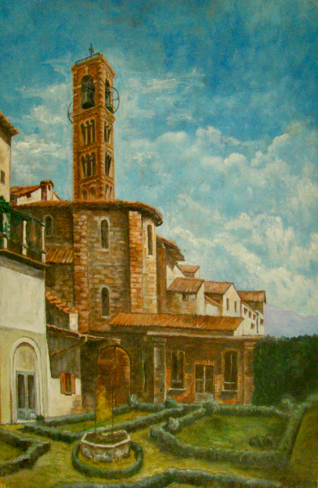
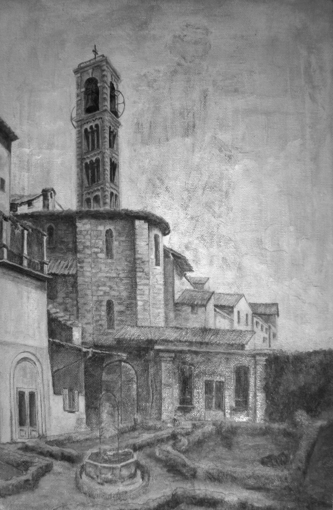
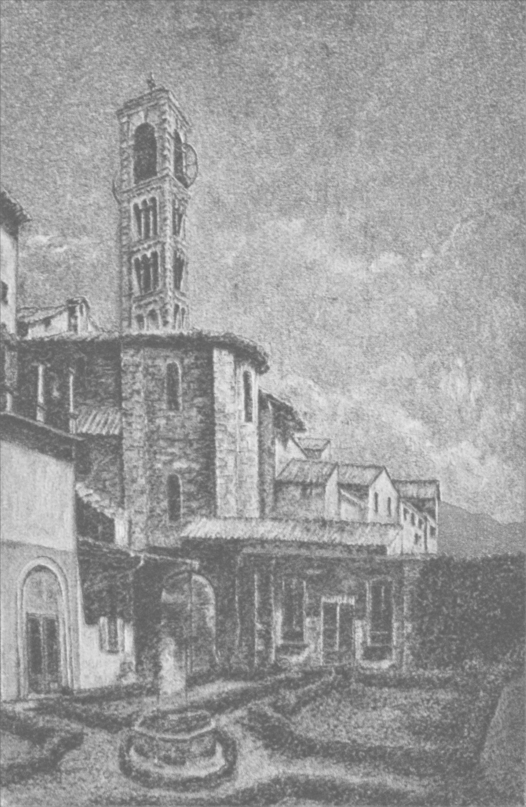
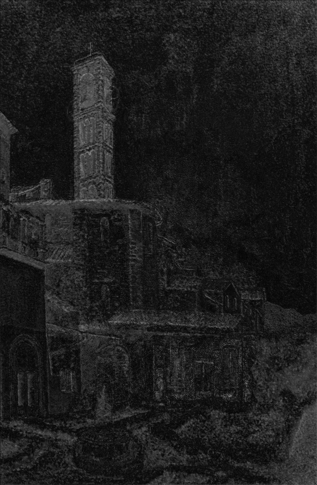

# Deep Layers

Deep learning pipeline for RGB → infrared (IR) image translation applied to **reflectography** of paintings. The model learns to predict the expected IR appearance of a painting from its RGB photograph; deviations between the real IR image and the prediction reveal underdrawings and preparatory sketches hidden beneath paint layers. Two families of model are implemented — deterministic (a single predicted IR value per pixel) and heteroscedastic (a predicted mean **and** a learned per-pixel uncertainty), the latter because the same visible-light color can legitimately map to more than one IR reflectance, which a point estimate alone cannot represent.

---

## Example painting

RGB » IR » Predicted IR » Delta

<table width="100%">
  <tr>
    <td align="center" width="25%"></td>
    <td align="center" width="25%"></td>
    <td align="center" width="25%"></td>
    <td align="center" width="25%"></td>
  </tr>
</table>

---

## Methodology

### Problem framing

Infrared reflectography is a non-invasive technique used in art conservation to examine the layers beneath a painting's surface. Carbon-based underdrawings (charcoal, chalk, lead-point) absorb IR radiation differently from paint layers, making them visible in IR images.

Rather than analysing IR images directly, this pipeline learns the mapping RGB → predicted IR from paired training data. The residual signal

```
raw_delta = |real_IR − predicted_IR|
```

isolates regions where the observed IR deviates from what the model expects given the paint surface — a starting indicator of underlying structure. In practice, `raw_delta` conflates genuine hidden detail with substrate/acquisition-driven gray-level shifts; `structural_delta` (below) and, for the heteroscedastic models, the learned z-score are the signals actually used for evaluation.

### Architectures

Six deterministic and four heteroscedastic encoder–decoder architectures are implemented and benchmarked:

| Architecture | Key feature | Ref. |
|---|---|---|
| **UNet** | Standard skip connections; solid baseline | [1] |
| **ResUNet** | Residual blocks in encoder/decoder; better gradient flow on small datasets | [2, 3] |
| **Attention UNet** | Additive attention gates on skip connections; suppresses irrelevant background features | [4] |
| **EfficientNet UNet** | EfficientNetB0 pretrained encoder (ImageNet); frozen weights + UNet decoder | [5, 6] |
| **UNet v2** | `unet` with three independently-toggleable modifications: learned strided-conv downsampling, upsample-conv (avoids checkerboard artifacts), bottleneck-only spatial dropout | [16, 17] |
| **UNet Restormer** | `unet` with a Restormer transposed-attention block at the bottleneck — the network's only self-attention, linear cost in image size | [15] |

Each of the four base architectures (UNet, ResUNet, Attention UNet, EfficientNet UNet) has a **heteroscedastic counterpart** (`unet_nll`, `resunet_nll`, `attention_unet_nll`, `efficientnet_unet_nll`) predicting a 2-channel `(mu, log_var)` output instead of one value — see "Uncertainty" below.

All models accept images of any spatial size at inference time (dynamic padding to the nearest multiple of 16).

### Loss functions

| Architecture | Loss | Ref. |
|---|---|---|
| UNet, UNet v2, UNet Restormer, ResUNet, Attention UNet | `combined_loss`: MAE + (1 − SSIM) | [7] |
| EfficientNet UNet | `combined_loss_advanced`: MAE + Laplacian pyramid + FFT magnitude | [8, 9] |
| All four `*_nll` architectures | `gaussian_nll_loss`, or `beta_gaussian_nll_loss` (Seitzer et al.'s correction for gradient starvation in high-variance regions) | [12, 13, 14] |

**Laplacian pyramid loss** decomposes the prediction error into spatial frequency bands and weights finer detail more heavily. **FFT magnitude loss** penalises errors in the 2D Fourier magnitude spectrum uniformly across all frequencies, preventing the model from sacrificing high-frequency accuracy to minimise low-frequency error.

### Uncertainty

The RGB→IR mapping is inherently one-to-many: pigments that look alike in visible light can have markedly different IR reflectance, so a single deterministic prediction per pixel forces the network to average over genuinely ambiguous cases. The `*_nll` architectures instead predict a mean `mu` (same role as the deterministic output) and a log-variance `log_var`, trained with a Gaussian negative-log-likelihood loss [12, 13]. At inference, the learned `sigma = exp(0.5 * log_var)` gives a color/context-conditioned normalization of the delta signal:

```
z = (real_IR - mu) / sigma
```

A pixel with a large raw delta but high learned `sigma` (a color the model has seen vary a lot in training) yields a small, unremarkable `z`; a pixel with a modest raw delta but low `sigma` yields a large `z` — a genuine anomaly candidate. `sigma` is learned from RGB context alone and never conditioned on the real IR value at inference, so it cannot "explain away" a real anomaly.

### Signal evaluation

Two refinements on top of `raw_delta`, combinable:

- **structural delta** (`1 - local SSIM structure`, `scripts/delta_analysis.py`) — isolates the structural-similarity term, insensitive to substrate/acquisition gray-level shifts that inflate `raw_delta` without indicating hidden content.
- **structural z-score** (`structural_delta / sigma`, `scripts/calibration.py`) — combines both refinements; the best-performing signal found in this project's evaluation work, for the heteroscedastic models.

Two independent evaluation axes:

- **Detection against real ground-truth masks** (`scripts/detection.py`) — AUROC/average precision of any candidate signal against a hand-drawn mask (`data/test/annotations/<stem>_Map.png`).
- **Stroke coherence** (`scripts/stroke_stats.py`) — reference-free structure-tensor coherence; an underdrawing is made of oriented, elongated strokes, prediction noise is isotropic, so this corroborates the mask-based ranking without needing one.

`scripts/calibration.py` additionally scores whether a heteroscedastic model's `sigma` itself can be trusted (coverage probability, ENCE reliability, sharpness/dispersion) [18, 19] — independent of whether the resulting z-score is a good detection signal, since a large constant `sigma` would be "calibrated" while being useless.

### Training

- **Input**: RGB image `(H, W, 3)`, values normalised to `[0, 1]`
- **Target**: IR image `(H, W, 1)`, grayscale, values normalised to `[0, 1]`
- **Optimiser**: Adam [10]
- **Regularisation**: Batch Normalisation [11] throughout; EarlyStopping + ReduceLROnPlateau callbacks; `unet_v2` additionally offers bottleneck-only `SpatialDropout2D`
- **Augmentation**: random horizontal/vertical flips applied to both channels; brightness/contrast jitter on RGB only (IR reflectance is a physical property, not an illumination artefact); optional paired random crop (`CROP_SIZE`) sharing one crop box across RGB and IR. All augmentation is stateless and seeded, and runs **only** on the training split — evaluation and inference always use full images
- **Data split**: artwork-and-mockups (`scripts/dataset.py::mockup_aware_train_val_test_split`) — real artworks are grouped so every section of one painting stays in a single fold (no leakage), while a handful of synthetic paint-on-support mockup groups (created specifically to aid training) are instead split at the individual-pair level, since holding an entire mockup group out would waste them

### Inference

Every notebook predicts on a whole image at once (`scripts/dataset.py::pad_to_multiple` pads to the nearest multiple of 16, then a single `model.predict()` call) — including the full-resolution `data/test/` images, which run several times larger than the 400×400 training patches. This is an open question, not a settled design decision — see `code-review.md` §4.

---

## Project Structure

```
deep_layers/
├── data/
│   ├── ir/                          # Infrared images (not versioned)
│   ├── rgb/                         # RGB images (not versioned)
│   └── test/                        # Held-out real paintings for perceptual/ground-truth evaluation (not versioned)
│       ├── rgb/, ir/                # (rgb, ir) pairs, larger than training patches
│       └── annotations/             # Hand-drawn masks, <stem>_Map.png, for the images that have one
├── models/                          # Checkpoints, one tree per model family (not versioned)
│   ├── deterministic/<arch>/best_model.keras
│   ├── nll_gaussian/<arch>/best_model.keras
│   └── nll_beta/<arch>/best_model.keras
├── logs/                            # TensorBoard event files (not versioned)
├── notebooks/
│   ├── 010_eda.ipynb                 # Dataset exploration and split validation
│   ├── 020_training.ipynb            # Train the four base deterministic architectures
│   ├── 021_training_nll.ipynb        # Train the four NLL architectures, gaussian_nll
│   ├── 022_training_beta_nll.ipynb   # Train the four NLL architectures, beta_nll
│   ├── 023_training_variants.ipynb   # Train unet_v2, unet_restormer
│   ├── 030_evaluation.ipynb          # mae/ssim/psnr — the four base architectures
│   ├── 031_evaluation_nll.ipynb      # mae/ssim/psnr — NLL architectures, gaussian_nll
│   ├── 032_evaluation_beta_nll.ipynb # mae/ssim/psnr — NLL architectures, beta_nll
│   ├── 033_evaluation_variants.ipynb # mae/ssim/psnr — unet_v2, unet_restormer vs. unet
│   ├── 040_signal_evaluation.ipynb   # Signal detection (AUROC) — deterministic, ground-truth images
│   ├── 041_signal_evaluation_nll.ipynb # Signal detection + sigma calibration — NLL, ground-truth images
│   ├── 042_signal_evolution.ipynb    # Per-model: does each signal refinement actually help
│   ├── 050_signal_sweep.ipynb        # Signal maps — deterministic, every test image
│   ├── 051_signal_sweep_nll.ipynb    # Signal maps — NLL, every test image
│   ├── 052_model_comparison.ipynb    # User-chosen model subset, one signal across models
│   ├── 053_signal_evolution_sweep.ipynb # User-chosen model subset, every signal per model
│   └── C0_v1_v2.ipynb                # v1 vs. v2 — the same architectures, before and after the fixing rounds
├── scripts/
│   ├── config.py                     # Pydantic settings (paths, hyperparameters, split ratios)
│   ├── dataset.py                    # Pair loading, artwork-and-mockups split, tf.data pipeline
│   ├── augmentation.py               # TF-native paired augmentation
│   ├── unet.py / unet_v2.py / unet_restormer.py / resunet.py / attention_unet.py / efficientnet_unet.py
│   │                                  # Deterministic architectures [1-6, 15-17]
│   ├── unet_nll.py / resunet_nll.py / attention_unet_nll.py / efficientnet_unet_nll.py
│   │                                  # Heteroscedastic (mu, log_var) counterparts
│   ├── nll_layers.py                 # ClipLogVar — shared serializable layer for the four *_nll builders
│   ├── losses.py                     # combined_loss, combined_loss_advanced, gaussian/beta_gaussian_nll_loss
│   ├── metrics.py                    # PSNR/SSIM Keras metrics (deterministic and Mu*-prefixed NLL variants)
│   ├── trainer.py / trainer_nll.py   # Model factory, compilation, callbacks, checkpoint loading
│   ├── delta_analysis.py             # Local SSIM luminance/contrast/structure decomposition
│   ├── calibration.py                # Sigma calibration, learned z-score, structural z-score
│   ├── contrast.py                   # Display-contrast settings for z-score maps
│   ├── detection.py                  # AUROC/average-precision against a ground-truth mask
│   ├── stroke_stats.py               # Reference-free structure-tensor coherence
│   ├── reproducibility.py            # Global RNG seeding (set_global_seed)
│   └── visualization.py / visualization_nll.py  # Plotting utilities
├── tests/
│   └── unit/                         # Unit tests mirroring scripts/
├── env/
│   └── environment.yml               # Conda environment (option A in Setup)
├── code-review.md                    # Current-state code review: structure, open issues, unimplemented directions
├── pyproject.toml                    # Ruff and pytest configuration
├── requirements.txt                  # Python dependencies
└── LICENSE                           # CC BY-SA 4.0
```

---

## Setup

**Requirements**: Python 3.11.5. Either conda (option A, recommended) or pip (option B) — both install the same pinned versions.

### Option A — conda

`env/environment.yml` declares the interpreter and every dependency, so the environment is reproducible from one command:

```bash
# 1. Create the environment (named deep-layers)
conda env create -f env/environment.yml

# 2. Activate it — needed in every new shell
conda activate deep-layers
```

To rebuild it from scratch after editing `env/environment.yml`:

```bash
conda env remove -n deep-layers
conda env create -f env/environment.yml
```

### Option B — venv + pip

```bash
# 1. Create and activate a virtual environment
python -m venv .venv
source .venv/bin/activate

# 2. Install dependencies
pip install -r requirements.txt
```

### Verify the installation

```bash
# TensorFlow, Keras, and (on Apple Silicon) the Metal GPU device
python -c "import tensorflow as tf, keras; print(tf.__version__, keras.__version__, tf.config.list_physical_devices('GPU'))"

# Full unit-test suite — no data or checkpoints required
pytest -q
```

Expected: `2.16.2 3.15.1 [PhysicalDevice(name='/physical_device:GPU:0', device_type='GPU')]` and a green test run.

On Apple Silicon, `tensorflow-metal` (included in both dependency files) enables GPU acceleration via the Metal backend automatically — no additional configuration is needed.

**`keras` is pinned on purpose.** TensorFlow 2.16 requires `keras>=3` with no upper bound, so an unpinned install picks whatever is newest. The checkpoints under `models/` were saved by Keras 3.15; loading them under an earlier version fails with `GlorotUniform.__init__() got an unexpected keyword argument 'input_axes'`. Keep `keras==3.15.1` in step across `requirements.txt` and `env/environment.yml`, and retrain (or re-save) the checkpoints before moving to a newer Keras.

### Running the notebooks

Execute them in numeric order from the `notebooks/` directory — each series builds on the checkpoints/results of the one before it:

```
010                → explore the dataset, validate the split
020, 021, 022, 023 → train every architecture (base, NLL gaussian, NLL beta, unet_v2/restormer)
030, 031, 032, 033 → mae/ssim/psnr on the held-out test set, per family
040, 041, 042      → signal detection against real ground-truth masks (AUROC), per family + cross-family
050, 051, 052, 053 → perceptual signal inspection across every data/test/ image, per family + cross-family
C0                 → v1 vs. v2: every architecture that has a checkpoint in both generations, scored side by side
```

```bash
jupyter notebook notebooks/
```

`C0_v1_v2.ipynb` is out of the numeric series on purpose: it does not extend the pipeline, it compares the current checkpoints (`models/deterministic/`, `models/nll/`) against the pre-`fixing.md` ones kept under `models/v1/`, on the same `data/test/` images and with the same signals the 04x/05x series uses. It needs both generations on disk and nothing else.

`052`/`053` take an editable `MODELS` list (any mix of architectures/loss variants) rather than looping a fixed family — the default selection is the best two deterministic and best two NLL architectures found in the 03x/04x notebooks.

### Linting

```bash
ruff check scripts/ tests/
ruff format scripts/ tests/
```

### Testing

Unit tests cover the pure pipeline logic (split leakage prevention, padding, augmentation determinism, losses, metrics, the loss-selection registry, the convolutional architectures, signal/calibration/detection metrics). The EfficientNet UNet builders are excluded from unit tests because instantiating them downloads ImageNet weights.

```bash
# Run the suite
pytest

# With coverage
pytest --cov=scripts --cov-report=term-missing
```

---

## References

[1] O. Ronneberger, P. Fischer, T. Brox, "U-Net: Convolutional Networks for Biomedical Image Segmentation," *MICCAI*, 2015.[https://doi.org/10.48550/arXiv.1505.04597]

[2] Z. Zhang, Q. Liu, Y. Wang, "Road Extraction by Deep Residual U-Net," *IEEE Geoscience and Remote Sensing Letters*, 2018.[https://doi.org/10.48550/arXiv.1711.10684]

[3] K. He, X. Zhang, S. Ren, J. Sun, "Deep Residual Learning for Image Recognition," *CVPR*, 2016.[https://doi.org/10.1109/CVPR.2016.90]

[4] O. Oktay et al., "Attention U-Net: Learning Where to Look for the Pancreas," *Medical Imaging with Deep Learning (MIDL)*, 2018.[https://doi.org/10.48550/arXiv.1804.03999]

[5] M. Tan, Q.V. Le, "EfficientNet: Rethinking Model Scaling for Convolutional Neural Networks," *ICML*, 2019.[https://doi.org/10.48550/arXiv.1905.11946]

[6] J. Deng et al., "ImageNet: A Large-Scale Hierarchical Image Database," *CVPR*, 2009.[https://doi.org/10.1109/CVPR.2009.5206848]

[7] Z. Wang, A.C. Bovik, H.R. Sheikh, E.P. Simoncelli, "Image Quality Assessment: From Error Visibility to Structural Similarity," *IEEE Transactions on Image Processing*, 2004.[https://doi.org/10.1109/TIP.2003.819861]

[8] P.J. Burt, E.H. Adelson, "The Laplacian Pyramid as a Compact Image Code," *IEEE Transactions on Communications*, 1983.[https://doi.org/10.1109/TCOM.1983.1095851]

[9] Y. Jiang, S. Chang, Z. Wang, "Focal Frequency Loss for Image Reconstruction and Synthesis," *ICCV*, 2021.[https://doi.org/10.48550/arXiv.2012.12821]

[10] D.P. Kingma, J. Ba, "Adam: A Method for Stochastic Optimization," *ICLR*, 2015.[https://doi.org/10.48550/arXiv.1412.6980]

[11] S. Ioffe, C. Szegedy, "Batch Normalization: Accelerating Deep Network Training by Reducing Internal Covariate Shift," *ICML*, 2015.[https://doi.org/10.48550/arXiv.1502.03167]

[12] D.A. Nix, A.S. Weigend, "Estimating the Mean and Variance of the Target Probability Distribution," *IEEE ICNN*, 1994.[https://doi.org/10.1109/ICNN.1994.374138]

[13] A. Kendall, Y. Gal, "What Uncertainties Do We Need in Bayesian Deep Learning for Computer Vision?," *NeurIPS*, 2017.[https://doi.org/10.48550/arXiv.1703.04977]

[14] S.W. Zamir et al., "Restormer: Efficient Transformer for High-Resolution Image Restoration," *CVPR*, 2022.[https://doi.org/10.48550/arXiv.2111.09881]

[15] M. Seitzer, A. Tavakoli, D. Antic, G. Martius, "On the Pitfalls of Heteroscedastic Uncertainty Estimation with Probabilistic Neural Networks," *ICLR*, 2022.[https://doi.org/10.48550/arXiv.2203.09168]

[16] A. Odena, V. Dumoulin, C. Olah, "Deconvolution and Checkerboard Artifacts," *Distill*, 2016.[https://doi.org/10.23915/distill.00003]

[17] H. Li, Z. Xu, "Understanding the Disharmony between Dropout and Batch Normalization by Variance Shift," *CVPR*, 2019.[https://doi.org/10.48550/arXiv.1801.05134]

[18] D. Levi, L. Gispan, N. Giladi, E. Fetaya, "Evaluating and Calibrating Uncertainty Prediction in Regression Tasks," *Sensors*, 2022.[https://doi.org/10.48550/arXiv.1905.11659]

[19] T. Gneiting, F. Balabdaoui, A.E. Raftery, "Probabilistic Forecasts, Calibration and Sharpness," *JRSS-B*, 2007.[https://doi.org/10.1111/j.1467-9868.2007.00587.x]

---

## License

This project is licensed under the [Creative Commons Attribution-ShareAlike 4.0 International (CC BY-SA 4.0)](LICENSE) license.
