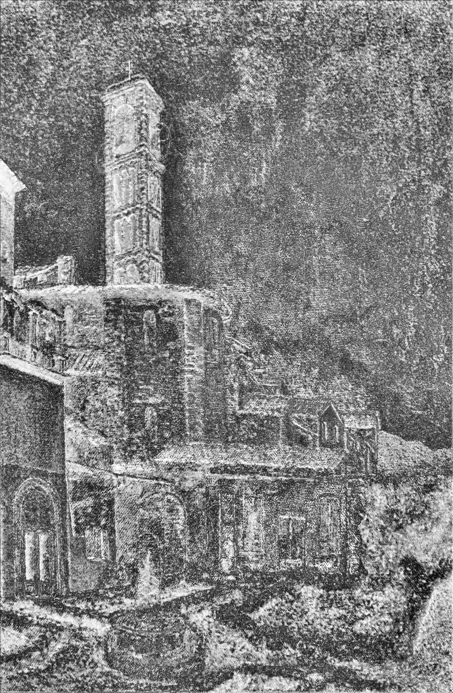

# Deep Layers

Deep learning pipeline for RGB → infrared (IR) image translation applied to **reflectography** of paintings. The model learns to predict the expected IR appearance of a painting from its RGB photograph; deviations between the real IR image and the prediction (`delta = |real_IR − predicted_IR|`) reveal underdrawings and preparatory sketches hidden beneath paint layers.

---

## Example painting

RGB » IR » Predicted IR » Delta (Clahe)

<table width="100%">
  <tr>
    <td align="center" width="25%"></td>
    <td align="center" width="25%"></td>
    <td align="center" width="25%"></td>
    <td align="center" width="25%"></td>
  </tr>
</table>

---

## Methodology

### Problem framing

Infrared reflectography is a non-invasive technique used in art conservation to examine the layers beneath a painting's surface. Carbon-based underdrawings (charcoal, chalk, lead-point) absorb IR radiation differently from paint layers, making them visible in IR images.

Rather than analysing IR images directly, this pipeline learns the mapping RGB → predicted IR from paired training data. The residual signal

```
delta = |real_IR − predicted_IR|
```

isolates regions where the observed IR deviates from what the model expects given the paint surface — a strong indicator of underlying structure.

### Architectures

Four encoder–decoder architectures are implemented and benchmarked:

| Architecture | Key feature | Ref. |
|---|---|---|
| **UNet** | Standard skip connections; solid baseline | [1] |
| **ResUNet** | Residual blocks in encoder/decoder; better gradient flow on small datasets | [2, 3] |
| **Attention UNet** | Additive attention gates on skip connections; suppresses irrelevant background features | [4] |
| **EfficientNet UNet** | EfficientNetB0 pretrained encoder (ImageNet); frozen weights + UNet decoder | [5, 6] |

All models accept images of any spatial size at inference time (dynamic padding to the nearest multiple of 16).

### Loss functions

Two variants are used depending on the architecture:

| Architecture | Loss | Ref. |
|---|---|---|
| UNet, ResUNet, Attention UNet | `combined_loss`: MAE + (1 − SSIM) | [7] |
| EfficientNet UNet | `combined_loss_advanced`: MAE + Laplacian pyramid + FFT magnitude | [8, 9] |

**Laplacian pyramid loss** decomposes the prediction error into spatial frequency bands and weights finer detail more heavily (geometric sequence: weight at level `k` = `2^(N−1−k)`, normalised). High-frequency bands — where underdrawing strokes live — receive the largest penalty.

**FFT magnitude loss** penalises errors in the 2D Fourier magnitude spectrum uniformly across all frequencies, preventing the model from sacrificing high-frequency accuracy to minimise low-frequency error. Loss is normalised by image area to remain scale-invariant.

### Training

- **Input**: RGB image `(H, W, 3)`, values normalised to `[0, 1]`
- **Target**: IR image `(H, W, 1)`, grayscale, values normalised to `[0, 1]`
- **Optimiser**: Adam [10]
- **Regularisation**: Batch Normalisation [11] throughout; EarlyStopping + ReduceLROnPlateau callbacks
- **Augmentation**: random horizontal/vertical flips applied to both channels; brightness/contrast jitter on RGB only (IR reflectance is a physical property, not an illumination artefact); optional paired random crop (`CROP_SIZE`) sharing one crop box across RGB and IR. All augmentation is stateless and seeded, and runs **only** on the training split — evaluation and inference always use full images
- **Data split**: by artwork ID — all sections of the same painting are assigned to a single fold, preventing leakage between train, validation, and test sets

### Inference

For images larger than the training patch size, `predict_with_overlap` in `scripts/inference_utils.py` splits the input into overlapping square patches (default stride = 50 %), runs the model on each, and blends predictions with per-pixel Gaussian weights. This eliminates the hard seam artefacts that arise from non-overlapping stitching.

---

## Project Structure

```
deep_layers/
├── data/
│   ├── ir/                       # Infrared images (not versioned)
│   └── rgb/                      # RGB images (not versioned)
├── models/                       # Saved checkpoints: {arch}/best_model.keras
├── logs/                         # TensorBoard event files
├── notebooks/
│   ├── 010_eda.ipynb             # Dataset exploration and split validation
│   ├── 020_training.ipynb        # Train all four architectures
│   ├── 030_evaluation.ipynb      # Quantitative comparison on the test set
│   └── 040_inference.ipynb       # Inference, delta visualisation, overlap inference
├── scripts/
│   ├── config.py                 # Pydantic settings (paths, hyperparameters)
│   ├── dataset.py                # Pair loading, grouped split, tf.data pipeline
│   ├── augmentation.py           # TF-native augmentation
│   ├── unet.py                   # UNet [1]
│   ├── resunet.py                # ResUNet [2, 3]
│   ├── attention_unet.py         # Attention UNet [4]
│   ├── efficientnet_unet.py      # EfficientNet UNet [5, 6]
│   ├── losses.py                 # combined_loss [7] · combined_loss_advanced [8, 9]
│   ├── metrics.py                # PSNR and SSIM Keras metric wrappers
│   ├── inference_utils.py        # Patch overlap inference with Gaussian blending
│   ├── trainer.py                # Model factory, compilation, callbacks, checkpoint loading
│   ├── reproducibility.py        # Global RNG seeding (set_global_seed)
│   └── visualization.py          # Plotting utilities
├── tests/
│   └── unit/                     # Unit tests mirroring scripts/
├── env/
│   └── environment.yml           # Conda environment (option A in Setup)
├── pyproject.toml                # Ruff and pytest configuration
├── requirements.txt              # Python dependencies
└── LICENSE                       # CC BY-SA 4.0
```

---

## Setup

**Requirements**: Python 3.11.5. Either conda (option A, recommended) or pip (option B) — both install the same pinned versions.

### Option A — conda

`env/environment.yml` declares the interpreter and every dependency, so the environment is reproducible from one command:

```bash
# 1. Create the environment (named deep-layers)
conda env create -f env/environment.yml

# 2. Activate it — needed in every new shell
conda activate deep-layers
```

To rebuild it from scratch after editing `env/environment.yml`:

```bash
conda env remove -n deep-layers
conda env create -f env/environment.yml
```

### Option B — venv + pip

```bash
# 1. Create and activate a virtual environment
python -m venv .venv
source .venv/bin/activate

# 2. Install dependencies
pip install -r requirements.txt
```

### Verify the installation

```bash
# TensorFlow, Keras, and (on Apple Silicon) the Metal GPU device
python -c "import tensorflow as tf, keras; print(tf.__version__, keras.__version__, tf.config.list_physical_devices('GPU'))"

# Full unit-test suite — no data or checkpoints required
pytest -q
```

Expected: `2.16.2 3.15.1 [PhysicalDevice(name='/physical_device:GPU:0', device_type='GPU')]` and a green test run.

On Apple Silicon, `tensorflow-metal` (included in both dependency files) enables GPU acceleration via the Metal backend automatically — no additional configuration is needed.

**`keras` is pinned on purpose.** TensorFlow 2.16 requires `keras>=3` with no upper bound, so an unpinned install picks whatever is newest. The checkpoints under `models/` were saved by Keras 3.15; loading them under an earlier version fails with `GlorotUniform.__init__() got an unexpected keyword argument 'input_axes'`. Keep `keras==3.15.1` in step across `requirements.txt` and `env/environment.yml`, and retrain (or re-save) the checkpoints before moving to a newer Keras.

### Running the notebooks

Execute them in order from the `notebooks/` directory:

```
010_eda.ipynb          → explore the dataset and validate the split
020_training.ipynb     → train UNet, ResUNet, Attention UNet, EfficientNet UNet
030_evaluation.ipynb   → compare all four architectures on the test set
040_inference.ipynb    → run predictions, inspect delta heatmap, overlap inference
```

```bash
jupyter notebook notebooks/
```

### Linting

```bash
ruff check scripts/ tests/
ruff format scripts/ tests/
```

### Testing

Unit tests cover the pure pipeline logic (split leakage prevention, padding,
augmentation determinism, losses, metrics, overlap inference, the loss-selection
registry, and the convolutional architectures). The EfficientNet UNet builder is
excluded from unit tests because instantiating it downloads ImageNet weights.

```bash
# Run the suite
pytest

# With coverage
pytest --cov=scripts --cov-report=term-missing
```

---

## References

[1] O. Ronneberger, P. Fischer, T. Brox, "U-Net: Convolutional Networks for Biomedical Image Segmentation," *MICCAI*, 2015.[https://doi.org/10.48550/arXiv.1505.04597]

[2] Z. Zhang, Q. Liu, Y. Wang, "Road Extraction by Deep Residual U-Net," *IEEE Geoscience and Remote Sensing Letters*, 2018.[https://doi.org/10.48550/arXiv.1711.10684]

[3] K. He, X. Zhang, S. Ren, J. Sun, "Deep Residual Learning for Image Recognition," *CVPR*, 2016.[https://doi.org/10.1109/CVPR.2016.90]

[4] O. Oktay et al., "Attention U-Net: Learning Where to Look for the Pancreas," *Medical Imaging with Deep Learning (MIDL)*, 2018.[https://doi.org/10.48550/arXiv.1804.03999]

[5] M. Tan, Q.V. Le, "EfficientNet: Rethinking Model Scaling for Convolutional Neural Networks," *ICML*, 2019.[https://doi.org/10.48550/arXiv.1905.11946]

[6] J. Deng et al., "ImageNet: A Large-Scale Hierarchical Image Database," *CVPR*, 2009.[https://doi.org/10.1109/CVPR.2009.5206848]

[7] Z. Wang, A.C. Bovik, H.R. Sheikh, E.P. Simoncelli, "Image Quality Assessment: From Error Visibility to Structural Similarity," *IEEE Transactions on Image Processing*, 2004.[https://doi.org/10.1109/TIP.2003.819861]

[8] P.J. Burt, E.H. Adelson, "The Laplacian Pyramid as a Compact Image Code," *IEEE Transactions on Communications*, 1983.[https://doi.org/10.1109/TCOM.1983.1095851]

[9] Y. Jiang, S. Chang, Z. Wang, "Focal Frequency Loss for Image Reconstruction and Synthesis," *ICCV*, 2021.[https://doi.org/10.48550/arXiv.2012.12821]

[10] D.P. Kingma, J. Ba, "Adam: A Method for Stochastic Optimization," *ICLR*, 2015.[https://doi.org/10.48550/arXiv.1412.6980]

[11] S. Ioffe, C. Szegedy, "Batch Normalization: Accelerating Deep Network Training by Reducing Internal Covariate Shift," *ICML*, 2015.[https://doi.org/10.48550/arXiv.1502.03167]

---

## License

This project is licensed under the [Creative Commons Attribution-ShareAlike 4.0 International (CC BY-SA 4.0)](LICENSE) license.
